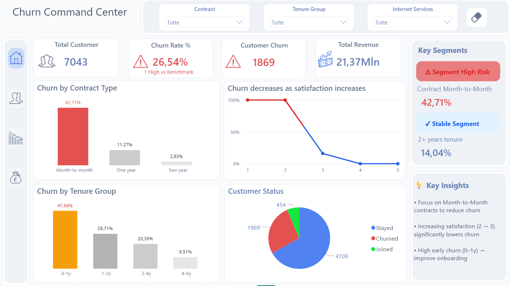
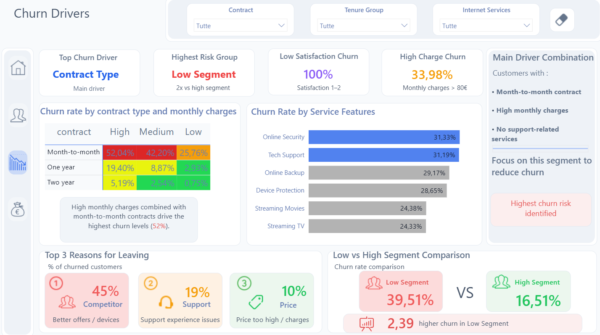
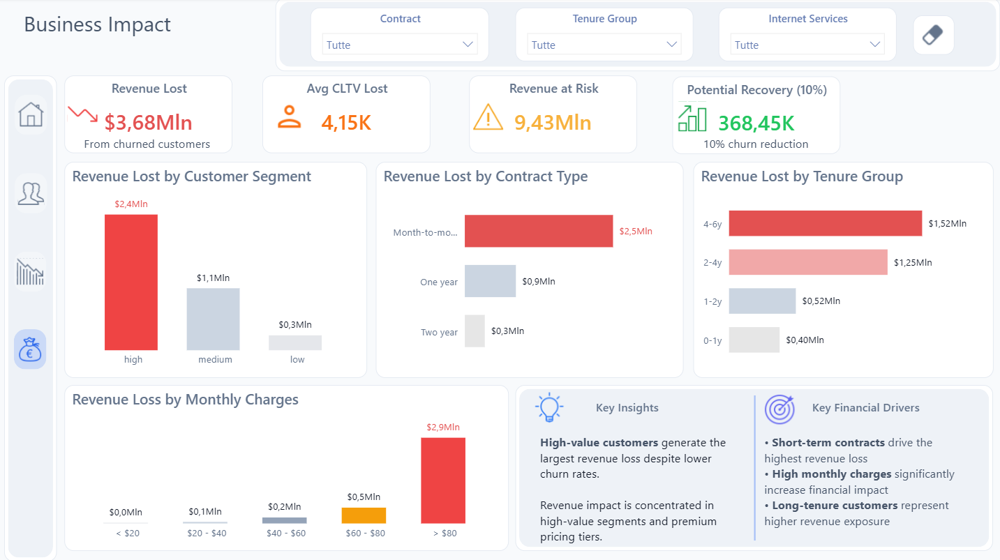

# 📊 Customer Churn Business Analysis  

## 📊 End-to-End Data Analysis Project (Python • SQL • Power BI)  

---

## 🔍 Project Overview  

This project analyzes customer churn from a business perspective, focusing on both customer behavior and financial impact.

The analysis answers key questions such as:
- Why do customers churn?  
- Which segments are most at risk?  
- What is the financial impact of churn?  
- How can retention strategies improve business performance?  

The project follows a complete end-to-end pipeline:

1. **Data Cleaning & Preparation (Python)**  
2. **Data Analysis & Querying (SQL)**  
3. **Data Visualization & Business Storytelling (Power BI)**  

---

## 🐍 Data Cleaning (Python)  

Python was used to preprocess and standardize the dataset before analysis.

### Key steps:
- Data inspection (`.info()`, `.describe()`, `.head()`)  
- Handling missing values and inconsistencies  
- Removing duplicates  
- String cleaning across object columns  
- Data type corrections  
- Feature engineering for segmentation and analysis  

This phase ensures **data quality, consistency, and reliability**, enabling accurate downstream analysis.

---

## 🗄️ Data Analysis (SQL)  

SQL was used to extract insights and support business-driven analysis.

### Key analyses performed:
- Customer segmentation and churn distribution  
- Revenue impact analysis by segment and contract type  
- Pricing impact on churn behavior  
- Identification of high-risk customer groups  
- Aggregations and filtering using `GROUP BY`, `HAVING`, and subqueries  

### Example use cases:
- Which customer segments have the highest churn rates?  
- How does pricing influence churn behavior?  
- Which contract types drive higher churn?  
- What is the distribution of revenue loss across segments?  

This step transforms raw data into **structured insights for decision-making**.

---

## 📊 Dashboard (Power BI)  

The final dashboard is designed to provide a clear business view of churn through four main sections:

### 1️⃣ Churn Command Center  
High-level KPIs and overall churn performance overview.

### 2️⃣ Customer Risk Profiling  
Identification of high-risk segments and churn patterns.

### 3️⃣ Churn Drivers & Insights  
Analysis of the key factors driving churn:
- contract type  
- pricing  
- satisfaction  
- service features  

### 4️⃣ Business Impact  
Evaluation of churn impact in financial terms:
- revenue loss  
- high-value customer impact  
- retention opportunities  

The dashboard focuses on **clarity, usability, and business storytelling**.

---

## 📈 Key Insights  

- Low-value customers show higher churn rates  
- High-value customers generate the largest revenue loss  
- Short-term contracts significantly increase churn risk  
- High monthly charges drive higher financial impact  
- Lack of support-related services is strongly associated with churn  

---

## 🚀 Business Impact  

Churn is not only a customer behavior issue but a measurable business risk.

Key findings:
- High-value customers represent the largest revenue loss  
- Contract structure and pricing are major drivers of financial impact  
- Targeting high-risk segments can significantly improve retention  

This analysis supports:
- Retention strategy optimization  
- Pricing strategy improvements  
- Risk reduction in high-value customer segments  

---

## 📷 Dashboard Preview  

### 1️⃣ Churn Command Center  

### 2️⃣ Customer Risk Profiling  

### 3️⃣ Churn Drivers & Insights  

### 4️⃣ Business Impact  

---

## 📂 Project Structure  

- **data/** → raw and cleaned datasets  
- **sql/** → analytical queries  
- **python/** → data cleaning scripts  
- **images/** → dashboard previews  

---

## 👤 Author  

**Edoardo Morgillo**  
Data Analyst  

🔗 Portfolio: https://edoardo-data-analyst.netlify.app/  
🔗 GitHub: https://github.com/MorgilloEdoardo  
